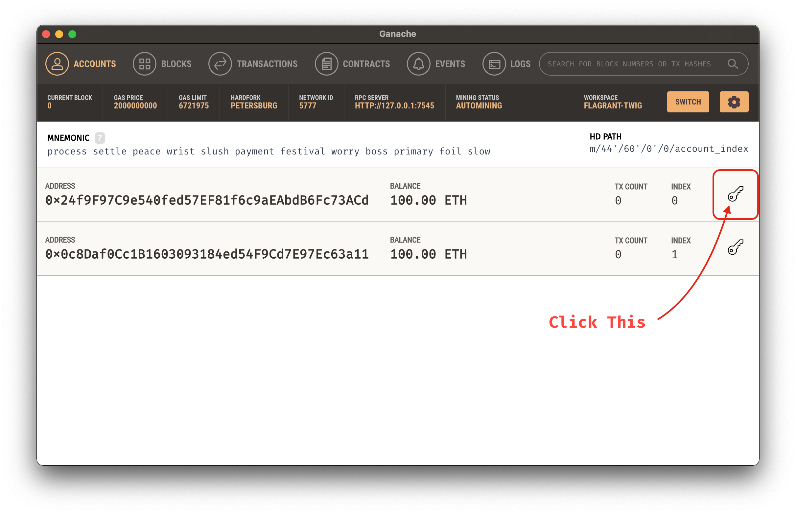
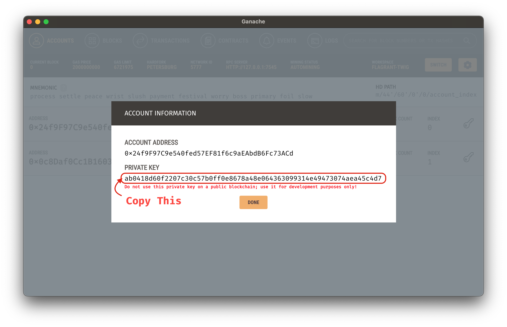

# niftygate - Drop-in Access Control via NFT Ownership

## The Pitch

Gate access to anything on the web, using any smart contract, deployed to any blockchain, without modifying your code.

## Overview

If you think of a token like a ticket to your club, NiftyGate would be the bouncer at the door.

  - Compatible with the typical token standards, both fungible and not (ERC20, ERC721, ERC777, and ERC1155).
  - Plays nice with any blockchain that speaks Web3 via WebSockets.
  - Sits in front of anything that speaks HTTP.
  - Has an embedded mode for use with client applications.
  - Integrates with any auth system that supports HTTP headers.
  - Comes with tools for choosing, deploying, debugging, and auditing compatible smart contracts.
  - All shipped as  single, self-contained binary.

  - Cross-platform (tested on Linux and macOS, should work elsewhere).
  - Open Source (MIT licensed), and written in Rust.

## What is it?

`niftygate` is a proxy for HTTP services, that validates signatures, providing
an AuthN layer for those services. It also has functionality for clients,
automatically injecting signatures into requests.

## What could I use this for?

As of `0.2`, Smart Contracts are supported. These allow using tokens as transferrable licenses to gated services.

Some examples:
  - An OCI Registry that allowed licensed users to download an asset.
  - An Issue Tracker that allowed project supporters to get priority support.
  - A Project Roadmap that allowed customers proportional voting rights on feature development.
  - A Deployment Pipeline that required at N-of-M authorized users to release to production.
  - An App Store with decentralized licenses, where authors retain licensing control, not platforms.
  - A Digital Library where lending is managed by tokens, and returns are enforced by Smart Contracts.

## Why does this exist?

This is really two questions, so let's break that down...

### Why is this concept useful?

Signature-based authentication avoids many of the pitfalls of password-based
authentication. The server only needs to know public keys, and if those are
leaked... who cares? They're *public* keys.

Assuming a reasonable UI in both cases, users can rotate keys just as easily as
passwords. They can delegate a subset of permissions to other keys (just as we
do with access tokens elsewhere).

Keys are things users *generate*, not things users *memorize*. This removes
problems like password reuse entirely.

### Why is this approach practical?

Implementing this in the form of a proxy allows it to be applied to most existing
HTTP(S) applications without modification.

Separating the signing from the verification allows more fine-grained control
over what has access to private keys. It also means the proxy can be used only
where needed. If a client application can handle signing natively, then it should.

Implementing this as a set of composable middleware makes it simple to extend,
and (responsibly) experiment with new features.

It can be deployed as a sidecar container, if you're into that sort of thing.

## How do I obtain this majestic tool?

```shell
cargo install niftygate
```

Or, if you prefer Docker:

```shell
docker pull colstrom/sig-proxy:0.3.1
```

## How do I use it?

First, you'll need some sort of service you want to put the proxy in front of.

For demonstration and development purposes, `niftygate` includes an embedded
sample service that prints the request headers in the response body.

```shell
$ niftygate demo
tide::log Logger started
    level DEBUG
tide::server Server listening on http://127.0.0.1:8080
```

Next, you'll need to have an Ethereum JSON-RPC (Web3) service available for
`niftygate` to interact with. [Ganache](https://www.trufflesuite.com/ganache)
is an excellent option for local use, so the rest of this document assumes that.

First, pick the address you want to use for signing requests:


Then, find the private key for this address:


Add this private key to the environment:

Using `fish`:
```shell
set -x SECRET_KEY_DATA PUT_THE_DATA_HERE
```

Using vintage shells like `bash`:
```shell
export SECRET_KEY_DATA=PUT_THE_DATA_HERE
```

Now you're ready to run it! Let's have a look at the help:

```shell
$ niftygate web3 --help

niftygate-web3 0.1.0
Runs the proxy service

USAGE:
    niftygate web3 [FLAGS] [OPTIONS]

FLAGS:
    -h, --help                             Prints help information
    -V, --provides-account-verification    verify signatures and provide account addresses
    -B, --provides-balances                provide account balances
    -S, --provides-signatures              provide signatures
        --version                          Prints version information

OPTIONS:
        --address-header <name>        [env: ADDRESS_HEADER=]    [default: X-Web3-Account-Address]
    -b, --backend <url>                [env: BACKEND=]           [default: http://127.0.0.1:8080]
        --balance-header <name>        [env: BALANCE_HEADER=]    [default: X-Web3-Account-Balance]
        --balance-maximum <amount>     [env: BALANCE_MAXIMUM=]
        --balance-minimum <amount>     [env: BALANCE_MINIMUM=]
    -u, --balance-scale <unit>         [env: BALANCE_SCALE=]     [default: Wei]
    -c, --challenge <phrase>           [env: CHALLENGE=]         [default: totes-legit]
    -l, --listen <address>             [env: LISTEN=]            [default: 0.0.0.0:8000]
    -K, --secret-key-data <hex>        [env: SECRET_KEY_DATA=]
    -k, --secret-key-file <path>       [env: SECRET_KEY_FILE=]
        --signature-header <name>      [env: SIGNATURE_HEADER=]  [default: X-Web3-Signature]
    -w, --web3-rpc-url <url>           [env: WEB3_RPC_URL=]      [default: ws://127.0.0.1:7545]
```

All of those options are optional, though it doesn't **do** anything unless you
enable at least one of them. Let's focus on two scenarios.

### Scenario 1 - Providing Signatures

In this mode, `niftygate` adds a signature to every request it handles.

```shell
$ niftygate web3 --provides-signatures
tide::log Logger started
    level DEBUG
tracing::span new
tracing::span build
isahc::agent agent waker listening on 127.0.0.1:61558
isahc::agent agent_thread; port=61558
isahc::agent agent took 409.705µs to start up
tide::server Server listening on http://0.0.0.0:8000
```

A secret (private) key is needed to sign these requests, though. It can be given
as a file (`--secret-key-file`), or a hex string (`--secret-key-data`). If both
are given, `--secret-key-file` is ignored. These can also be given via
environment, which is exactly what we did above.

This key is used to sign a challenge phrase (currently given by `--challenge`),
which should be known to both client and server. It does not need to be private.

This signature is added to the request using the header given by `--signature-header`.

### Scenario 2 - Providing Account Verification

In this mode, `niftygate` expects requests to contain a signature header, and
will reject requests that do not contain one. These headers will be verified,
and the address used to sign them will be added to each request it handles.

Note that the client does not explicitly provide an address. They sign a
challenge phrase that is known to both signer and verifier, and the signing
address is recoverable from a valid signature.

```shell
$ niftygate web3 --provides-account-verification
tide::log Logger started
    level DEBUG
tracing::span new
tracing::span build
isahc::agent agent waker listening on 127.0.0.1:56181
isahc::agent agent_thread; port=56181
isahc::agent agent took 312.747µs to start up
tide::server Server listening on http://0.0.0.0:8000
```

If the signature is valid, the address is added to the request using the header
given by `--address-header`. It is assumed that the backend knows what to do
with this header. For instance, you could use the `X-Remote-User` header to
integrate `niftygate` with [Dex](https://dexidp.io/docs/connectors/authproxy/).

### Scenario 3 - Providing Account Balances

In this mode, `niftygate` expects requests to contain an account header, and
will reject requests that to not contain one. The balance of the address given
in this header will be added to each request it handles.

```shell
$ niftygate web3 --provides-balances
tide::log Logger started
    level DEBUG
tracing::span new
tracing::span build
isahc::agent agent waker listening on 127.0.0.1:54608
isahc::agent agent_thread; port=54608
isahc::agent agent took 313.524µs to start up
tide::server Server listening on http://0.0.0.0:8000
```

By default, this doesn't care *what* the balance is, it just adds it to the
header given by `--balance-header`. However, there are a few options to restrict
access based on the balance.

The `--balance-minimum` option can be used to require a minimum balance. This
can be used as a form of "skin in the game", by requiring a non-zero balance
(which may be useful in to prevent bots or assist rate limiting), or to gate
access to only high rollers if you wanted to do that for some reason.

The `--balance-maximum` option can be used to reject accounts with a balance
over a given amount. This can be used to limit risk, or gate access to only the
common folk if you were so inclined.

The `--balance-unit` option can be used to conveniently scale the above limits.
How many zeroes are there in a Gwei? No need to remember, just set
`--balance-unit=Gwei` and `niftygate` will do the scaling internally. The
balance header will still be given in Wei, though.

## Notes

The examples above show demonstrate using the features independently, but they
are all implemented as composable middleware. You can enable all of them in a
single process. It seems a bit silly to use both signing and verifying in the
same process, but there's no reason you **can't** do it.

## Try it out!

Assuming you've enabled all the features, and the proxy is in front of the demo
application, if you were to query each with `curl`, you'd see something like the
following:

Querying the demo app directly:
```shell
$ curl -s http://127.0.0.1:8080 | sort
accept: ["*/*"]
host: ["127.0.0.1:8080"]
user-agent: ["curl/7.64.1"]
```

Querying through the proxy:
```shell
$ curl -s http://127.0.0.1:8000 | sort
accept-encoding: ["deflate, gzip"]
accept: ["*/*"]
content-length: ["0"]
content-type: ["application/octet-stream"]
forwarded: ["by=127.0.0.1:8000;for=\"127.0.0.1:52698\";host=127.0.0.1:8000;proto=http"]
host: ["127.0.0.1:8000"]
user-agent: ["curl/7.64.1"]
x-web3-address: ["24f9f97c9e540fed57ef81f6c9aeabdb6fc73acd"]
x-web3-balance: ["100000000000000000000"]
x-web3-signature: ["krpQZO9WpgAEso2uk6eAKDy29QjeVtr+gdDZ7iG4bFkYiTfNvTvU5l4bb2iod5F4Ab8a8tJqzXHSXLkyz9U/gRs="]
```

## Smart Contracts

### Embedded Presets

To help you get started, `niftygate` embeds a set presets from the OpenZeppelin
project. These address some of the more common use cases, and are (according to
the OpenZeppelin documentation) production-ready.

Currently, there are five presets included, along with utilities for deploying
and interacting with each. These can be found under the `contract` subcommand.

To help you figure out which contract is appropriate, check the `guide`
subcommand. There you'll find an interactive program that will ask you a few
simple questions, and present you with a recommendation.

## Roadmap

- 0.1 - Initial Release with Web3 Account Verification
- 0.2 - Support Token Standards
  - Support for [ERC-20 (Token Standard)](https://eips.ethereum.org/EIPS/eip-20)
  - Support for [ERC-777 (Token Standard)](https://eips.ethereum.org/EIPS/eip-777)
  - Support for [ERC-721 (Non-Fungible Token Standard)](https://eips.ethereum.org/EIPS/eip-721)
  - Support for [ERC-1155 (Multi Token Standard)](https://eips.ethereum.org/EIPS/eip-1155)
- 0.3 - Observability for Smart Contracts
- 0.5 - Support Upgradeable Smart Contracts
- 0.6 - Renamed from sig-proxy to NiftyGate
- 0.7 - TLS Support

## Wishlist (in no particular order)

Support for [RFC-7486 (HTTP Origin-Bound Authentication)](https://tools.ietf.org/html/rfc7486)
  - Replacing fixed messages with random challenges, adding nonces and expiration, etc.

Optional endpoint to serve an embedded script for in-browser support.
  - Use [Web Crypto API](https://developer.mozilla.org/en-US/docs/Web/API/Web_Crypto_API) for key generation and signing.
  - Use [Web Storage API](https://developer.mozilla.org/en-US/docs/Web/API/Web_Storage_API) for key storage.
  - Use [Fetch API](https://developer.mozilla.org/en-US/docs/Web/API/Fetch_API) for header manipulation and auth flow.

X509 Support
  - This would provide an alternative where a chain-of-trust model is preferred.

PGP Support
  - This would provide an alternative where a web-of-trust model is preferred.

## License

`niftygate` is available under the MIT License. See `LICENSE.txt` for the full text.

`niftygate` embeds contract ABI specs, and documentation excerpts from [OpenZeppelin Contracts](https://github.com/OpenZeppelin/openzeppelin-contracts).
These are also distributed under the terms of the MIT License [here](https://github.com/OpenZeppelin/openzeppelin-contracts/blob/v4.1.0/LICENSE).
